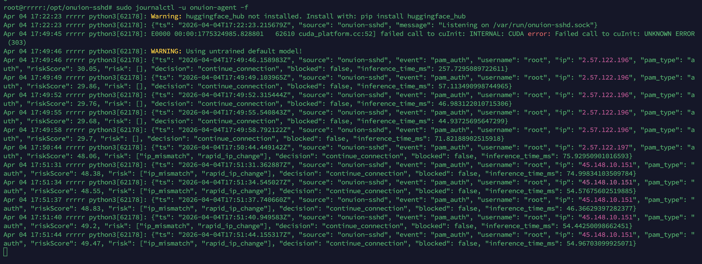

# Onuion SSHD PAM Agent 🛡️

Onuion SSHD PAM Agent is a real-time risk analysis and enforcement layer for SSH connections. It integrates deeply with the Linux PAM (Pluggable Authentication Modules) stack to analyze login attempts, calculate risk scores, and automatically block malicious actors before they can gain access.

## 🚀 Features

- **Real-time Risk Scoring:** Uses the `onuion` engine to evaluate SSH login attempts based on historical data.
- **PAM Integration:** Lightweight bridge between the PAM auth process and the security agent.
- **Automated Enforcement:** Automatically blocks high-risk IP addresses using `iptables`.
- **Stateful Analysis:** Tracks IP and User history (successful/failed attempts, device fingerprints, geo-data stubs).
- **Daemon Mode:** Runs as a standard `systemd` service for reliability and persistent monitoring.
- **JSON Logging:** Structured logs for easy integration with SIEM or log management tools.

## 🏗️ Architecture

1.  **`agent.py`**: The central daemon listening on a Unix domain socket. It holds the `SSHState` and performs risk calculations.
2.  **`pam_onuion_check.py`**: The execution bridge. When a user connects via SSH, PAM triggers this script, which queries the agent for a "Continue" or "Block" decision.
3.  **`enforcer.py`**: Handles the actual blocking of IP addresses at the firewall level.
4.  **`state.py` & `normalizer.py`**: Manages the in-memory database of activities and formats it for the analysis engine.

## 🛠️ Installation

### 1. Prerequisites

- Python 3.8+
- `iptables` (for IP blocking)
- PAM-enabled Linux system (Ubuntu, Debian, CentOS, etc.)

### 2. Setup the Agent

```bash
# Clone the repository
git clone https://github.com/onuion/sshd.git onuion-sshd
cd onuion-sshd

# Install dependencies
pip install -r requirements.txt

# Create the application directory
sudo mkdir -p /opt/onuion-sshd
sudo cp * /opt/onuion-sshd/

# Create virtual environment
cd /opt/onuion-sshd
python3 -m venv venv
/opt/onuion-sshd/venv/bin/pip install --upgrade pip
/opt/onuion-sshd/venv/bin/pip install -r requirements.txt
```

### 3. Install Systemd Service

```bash
sudo cp onuion-agent.service /etc/systemd/system/
sudo systemctl daemon-reload
sudo systemctl enable onuion-agent
sudo systemctl start onuion-agent
```

### 4. Install the CLI Tool (osshd)

To manage the agent from anywhere, create a symlink:

```bash
sudo ln -sf /opt/onuion-sshd/cli.py /usr/local/bin/osshd
sudo chmod +x /opt/onuion-sshd/cli.py
```

### 5. Configure PAM

To enable the agent for SSH sessions, you need to add it to your PAM configuration (usually `/etc/pam.d/sshd` or `/etc/pam.d/common-auth`):

Add the following line to the top of your PAM config:

```text
auth required pam_exec.so expose_authtok /usr/bin/python3 /opt/onuion-sshd/pam_onuion_check.py
```

*Note: The script uses environment variables provided by `pam_exec.so` (PAM_USER, PAM_RHOST) to communicate with the agent.*

## ⚙️ CLI Usage (`osshd`)

The `osshd` command is the main interface for managing the agent.

### Service Control
- `osshd start`: Start the agent service.
- `osshd stop`: Stop the agent service.
- `osshd restart`: Restart the agent (required after config changes).
- `osshd status`: Check the status of the service.

### Configuration Management
- `osshd config --list`: Show current configuration values.
- `osshd config --set KEY=VALUE`: Update a configuration value.

**Example:**
```bash
# Enable IP blocking
osshd config --set ENABLE_IP_BLOCK=True

# Increase block threshold
osshd config --set BLOCK_THRESHOLD=90

# Restart to apply
osshd restart
```

## 📊 Logging



The agent outputs structured JSON logs to the system journal:

```json
{
  "ts": "2024-04-04T12:00:00Z",
  "source": "onuion-sshd",
  "event": "pam_auth",
  "username": "admin",
  "ip": "1.2.3.4",
  "riskScore": 92,
  "decision": "close_connection",
  "blocked": true
}
```

## 🛡️ Security & Reliability

The agent is designed with a **Fail-Open** policy. If the agent service is down or there is a communication error, the PAM bridge will default to `continue_connection` to prevent legitimate users from being locked out due to an internal error.

---
*Developed with Onuion Risk Analysis Engine.*
